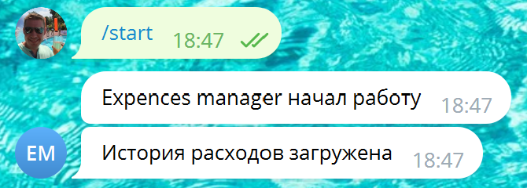
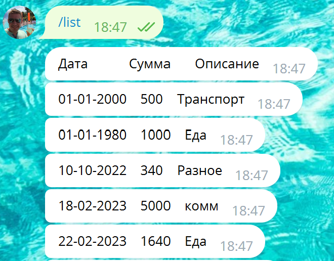
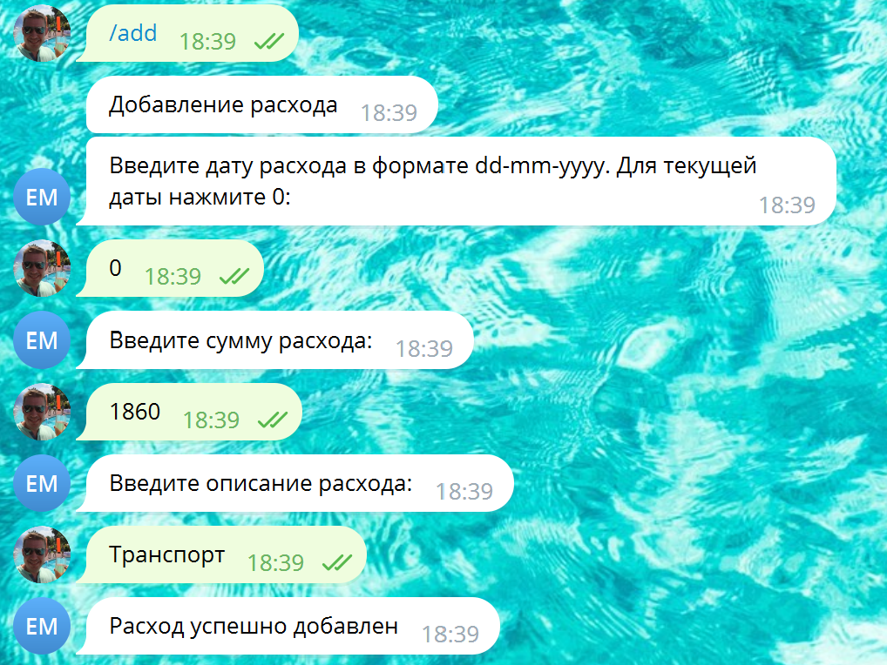
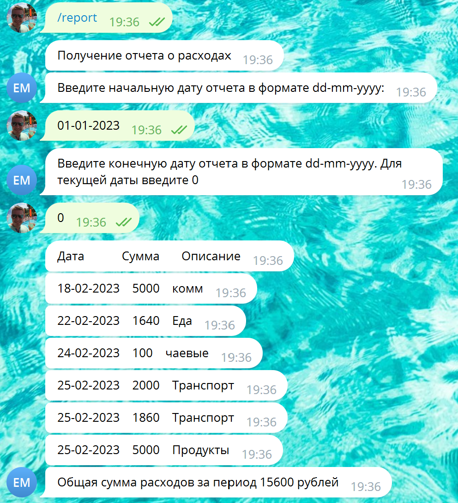
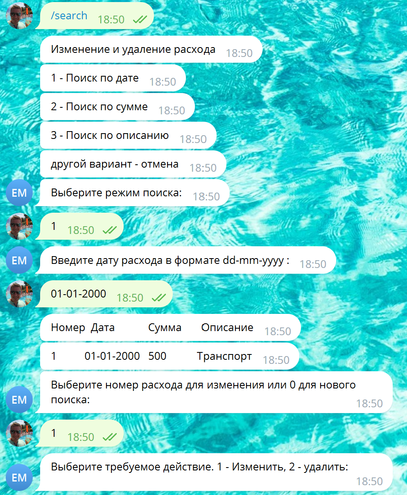
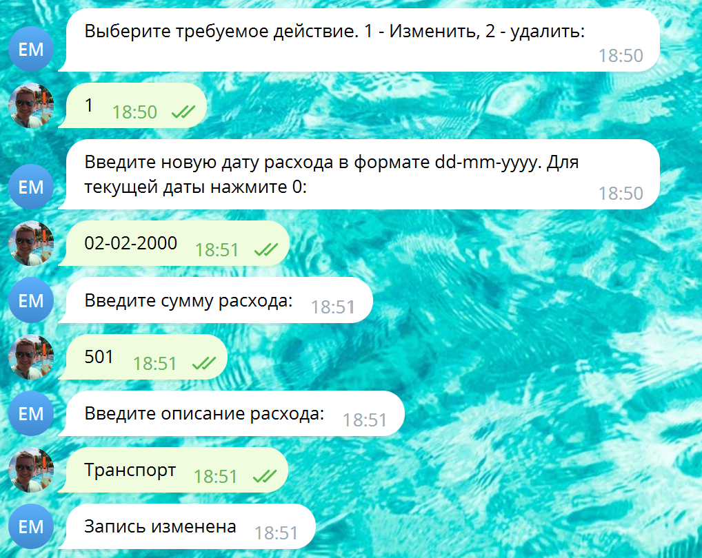
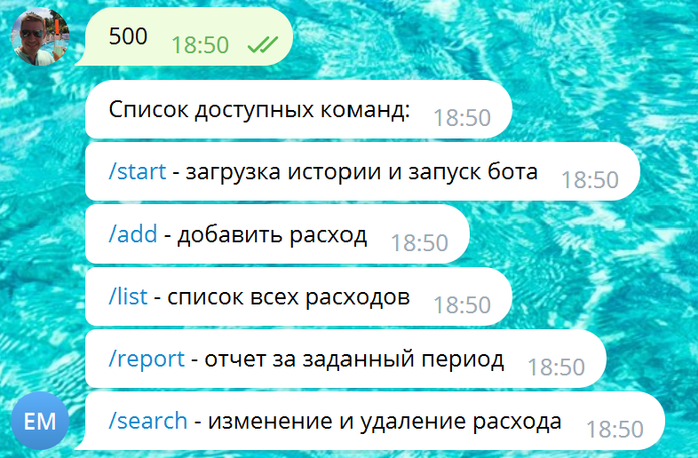

## Чат-бот по управлению личными расходами "Expence manager"

Expence manager предназначен для учета личных расходов с возможностью добавления, изменения, удаления расхода, а также составления отчета о расходах за заданный период.

Чат-бот доступен в двух версиях:
+ Локальная версия, работающая в терминале
+ Телеграм - версия

Чат бот поддерживает следующие команды:

### /start 
Запускает бот и загружает историю расходов из файла operations.json

### /list
Просмотр всех ранее введенных расходов

### /add
Добавление расхода.

Для указания текущей даты в терминальной версии используется Enter, в телеграм-версии символ "0"

Необходимо ввести следующие данные:

+ Дата расхода в формате dd-mm-yyyy
+ Сумма расхода
+ Описание расхода

После добавления расхода он автоматически сохраняется в файле

### /report
Формирует отчет по расходам за период. Также показывает общую сумма расходов в периоде

Требуется ввести начальную и конечную дату отчета.

Для указания текущей даты в терминальной версии используется Enter, в телеграм-версии символ "0"

### /search

Предназначен для поиска, изменения и удаления расходов.
Поиск расхода осуществляется по одному из параметров: дата расхода, сумма расхода, описание расхода. Реализован только строгий поиск по полному совпадению.
После ввода параметра бот выводит пронумерованный список расходов, удовлетворяющих заданному параметру. Выбор расхода из списка производится путем ввода его номера.

После выбора расхода пользователь выбирает требуемое действие: изменение или удаление расхода. При изменении пользователю требуется заново ввести все данные по расходу. Измененный расход автоматически сохраняется в файле.
При удалении расхода пользователь вводит подтверждение операции и расход автоматически удаляется из файла

### Список команд
При вводе иного значения бот выводит на экран список доступных команд

